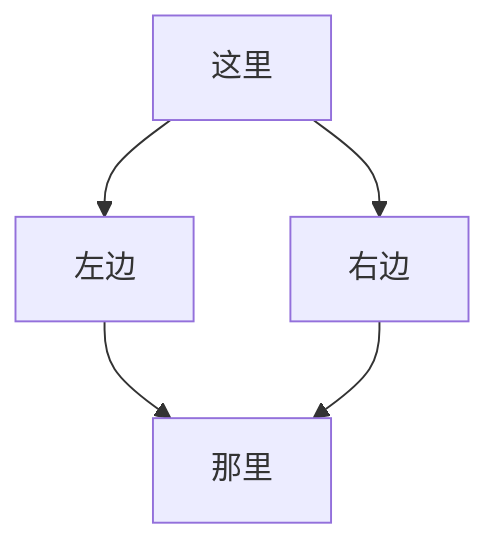

我是一只迷茫的小羔羊！

- 🔭 目前是一枚程序员，C程序员，Linux C程序员，移动终端Linux C程序员 ...
- 🌱 正在学习Rust，Vue ...
- 👯 正在寻找真我 ...
- 🤔 非常需要大佬的帮助 ...
- 💬 谁来救我 ...
- 📫 联系我: ...

<!--
**goodhubcn/goodhubcn** is a ✨ _special_ ✨ repository because its `README.md` (this file) appears on your GitHub profile.

Here are some ideas to get you started:

- 🔭 I’m currently working on ...
- 🌱 I’m currently learning ...
- 👯 I’m looking to collaborate on ...
- 🤔 I’m looking for help with ...
- 💬 Ask me about ...
- 📫 How to reach me: ...
- 😄 Pronouns: ...
- ⚡ Fun fact: ...
-->
